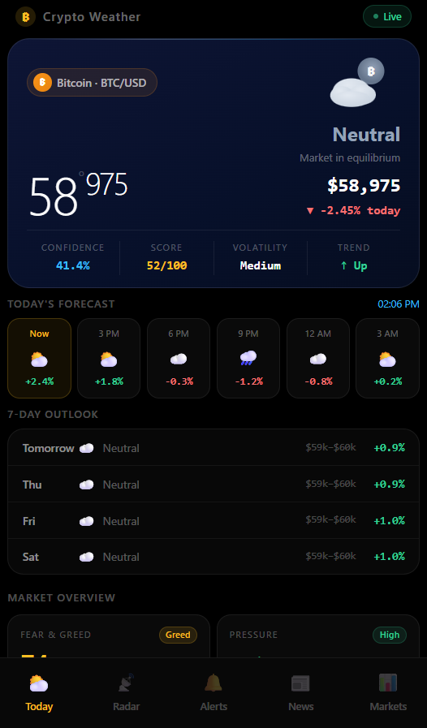

# ⛅ Crypto Weather

> Real-time crypto market conditions with a 7-day outlook, weather-style confidence scoring, and accuracy tracking.


---

## Screenshots

<div align="center">



</div>

A single-screen, no-scroll dashboard inspired by Apple Weather: a large weather-style price reading, an animated BTC cloud/sun icon, an hourly forecast strip, a 7-day outlook, and a market overview grid (Fear & Greed, buying/selling pressure, dominance, volume) — all in one view.

---

## Stack

| Layer    | Technology                              |
|----------|-----------------------------------------|
| Frontend | Next.js 14 · TypeScript · Tailwind CSS  |
| UI       | Framer Motion · custom SVG weather icons|
| Data     | TanStack Query · Next.js API routes     |
| Backend  | FastAPI · Python 3.12 (local/Docker)    |
| Analysis | Pandas · NumPy · scikit-learn           |
| DB       | PostgreSQL · SQLAlchemy · Supabase      |
| Tests    | Pytest (90% coverage) · Vitest (93%)    |
| CI/CD    | GitHub Actions                          |
| Deploy   | Vercel                                  |

---

## Quick Start

### With Docker (recommended for local dev)

```bash
git clone https://github.com/maic93/crypto-weather
cd crypto-weather
cp backend/.env.example backend/.env
docker compose up --build
```

| URL | |
|-----|-|
| http://localhost:3000 | App |
| http://localhost:8000/docs | API docs |

> First run takes ~3–5 minutes to build images.

### Local Development

**Backend:**
```bash
cd backend
python -m venv .venv && source .venv/bin/activate
pip install -r requirements.txt
cp .env.example .env
uvicorn app.main:app --reload
```

**Frontend:**
```bash
cd frontend
npm install
npm run dev
```

---

## API

| Endpoint             | Description                          |
|----------------------|--------------------------------------|
| `GET /api/health`    | Service health                       |
| `GET /api/current`   | Live price                           |
| `GET /api/forecast`  | Full forecast (hero + 7-day)         |
| `GET /api/history`   | Historical OHLC (default 30d)        |
| `GET /api/accuracy`  | 30-day forecast accuracy report      |
| `GET /api/metrics`   | RSI, MACD, SMA, EMA, etc.           |

---

## Testing

```bash
# Backend — 77 tests, 90% coverage
cd backend && pytest

# Frontend — 63 tests, 93% coverage
cd frontend && npm test
```

---

## Project Structure

```
crypto-weather/
├── frontend/
│   ├── src/
│   │   ├── app/
│   │   │   └── api/           # Next.js API routes (TS forecast engine)
│   │   ├── components/
│   │   │   ├── cards/         # HeroCard, ForecastCard, SevenDayCard, MarketMetricsCard
│   │   │   ├── layout/        # AnimatedBackground, BottomNav, LoadingScreen
│   │   │   └── ui/            # WeatherIcon (BTC cloud/sun SVG)
│   │   ├── hooks/             # TanStack Query hooks
│   │   ├── lib/               # forecast engine, CoinGecko client, utils
│   │   └── types/             # TypeScript interfaces
│   └── src/tests/             # Vitest unit + component tests
│
├── backend/
│   ├── app/
│   │   ├── api/routes/        # FastAPI route handlers
│   │   ├── forecast/          # Ensemble forecast engine (Python)
│   │   ├── models/            # ORM models
│   │   ├── schemas/           # Pydantic response schemas
│   │   └── services/          # CoinGecko, price, forecast services
│   └── tests/
│       ├── unit/
│       └── integration/
│
├── docs/
│   ├── screenshots/           # App screenshots
│   ├── Architecture.md
│   ├── Forecasting.md
│   └── Contributing.md
│
├── .github/workflows/
│   ├── ci.yml                 # Test + lint + build on every push
│   ├── daily-forecast.yml     # Daily price sync + forecast generation
│   ├── release.yml            # Auto-release on version tags
│   └── deploy.yml             # Deploy on merge to main
│
└── docker-compose.yml
```

---

## Docs

- [Architecture](docs/Architecture.md)
- [Forecasting methodology](docs/Forecasting.md)
- [Contributing](docs/Contributing.md)

---

## License

MIT — see [LICENSE](LICENSE)
